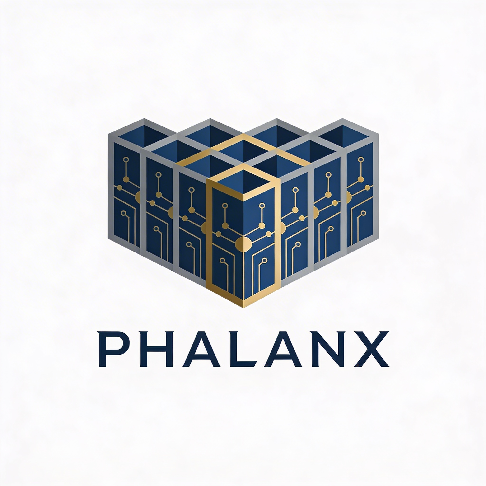

<p align="center">
  
</p>

# Phaylanx

**A modular AI skills framework built on the [GOTCHA architecture](https://agentskills.io/) for Claude Code, GitHub Copilot, and OpenAI Codex.**

Phaylanx provides a minimal core of essential skills — memory management, workspace organization, agent invocation, manifest checking, skill creation, self-improvement, system restoration, and bundle management — then lets you install optional bundles for cloud architecture, presentations, proposals, media generation, and more.

---

## Quick Start

### Claude Code

```bash
# 1. Create a new project directory
mkdir my-project && cd my-project

# 2. Start Claude Code and paste this:
#    "Bootstrap this project using https://github.com/luckybob34/phaylanx"
#
#    Claude will read bootstrap.md and set everything up.
```

### GitHub Copilot

```bash
# 1. Clone the core into your project
git clone --depth=1 https://github.com/luckybob34/phaylanx .tmp/phaylanx

# 2. Copy core files
cp -r .tmp/phaylanx/core/skills/* .claude/skills/
cp -r .tmp/phaylanx/core/tools/* tools/
cp -r .tmp/phaylanx/core/context/* context/
cp .tmp/phaylanx/core/CLAUDE.md ./CLAUDE.md
cp .tmp/phaylanx/core/config.yaml ./config.yaml

# 3. Generate Copilot instructions
python tools/platform/generate_instructions.py

# 4. Install bundles
python tools/platform/registry.py --list
python tools/platform/registry.py --install <bundle-name>
```

### OpenAI Codex

Same as Copilot setup. The `generate_instructions.py` script produces both `.github/copilot-instructions.md` and `AGENTS.md`.

---

## What's Included

### Core (Always Installed)

| Skill | Type | Purpose |
|-------|------|---------|
| `managing-memory` | Protocol | Persistent memory across sessions |
| `managing-workspaces` | Protocol | Project directory management |
| `invoking-agents` | Protocol | Specialist agent delegation |
| `checking-manifests` | Protocol | Pre-task manifest checks |
| `creating-skills` | Meta | Build new skills to agentskills.io spec |
| `improving-skills` | Meta | Error recovery and learning loop |
| `restoring-system` | Meta | Self-healing and system repair |
| `installing-bundles` | Meta | Bundle search, install, update, remove |

Plus: memory tools, platform tools, style guide, base HTML template, minimal CSS theme.

### Optional Bundles

| Bundle | Skills | Agents | Key Tools |
|--------|--------|--------|-----------|
| `cloud-architecture` | designing-architecture | aws-architect, azure-architect | architecture/* |
| `cloud-migration` | planning-cloud-migration | aws-architect, azure-architect | — |
| `cloud-iac` | deploying-infrastructure | iac-engineer, devops-engineer | iac/* |
| `cloud-review` | reviewing-architecture | aws-architect, azure-architect | — |
| `presentations-html` | building-html-decks, building-university-decks | — | — |
| `presentations-pptx` | building-pptx-decks | — | presentations/* |
| `proposals` | responding-to-rfps, building-sow | proposal-writer, researcher | proposals/* |
| `media` | creating-visuals, generating-*-diagrams/visuals | creative-director | media/* |
| `app-development` | building-apps | researcher, technical-writer | — |

---

## Bundle Management

```bash
# Search
python tools/platform/registry.py --search "cloud"

# List all
python tools/platform/registry.py --list

# Install
python tools/platform/registry.py --install cloud-architecture

# Update
python tools/platform/registry.py --update cloud-architecture
python tools/platform/registry.py --update-all

# Remove
python tools/platform/registry.py --remove cloud-architecture

# Show installed
python tools/platform/registry.py --installed
```

Or just tell your AI: *"Install the cloud architecture bundle"* — the `installing-bundles` skill handles the rest.

---

## Repository Structure

```
phaylanx/
├── bootstrap.md          # AI-readable installation playbook
├── catalog.yaml          # Searchable bundle index
├── README.md
│
├── core/                 # Required framework core
│   ├── CLAUDE.md         # System handbook
│   ├── config.yaml       # Global configuration
│   ├── skills/           # 8 core skills
│   ├── tools/            # Memory + platform tools
│   └── context/          # Style guide, base template, minimal theme
│
├── bundles/              # Bundle manifests (YAML)
│   ├── cloud-architecture.yaml
│   ├── cloud-migration.yaml
│   ├── cloud-iac.yaml
│   ├── cloud-review.yaml
│   ├── presentations-html.yaml
│   ├── presentations-pptx.yaml
│   ├── proposals.yaml
│   ├── media.yaml
│   └── app-development.yaml
│
├── skills/               # Installable workflow + atomic skills
├── agents/               # Specialist agent definitions
├── tools/                # Domain-specific tool scripts
├── themes/               # CSS and PPTX themes
│   ├── html/             # Brand CSS files
│   └── pptx/             # PowerPoint templates
└── context/              # Brand guides and component docs
    └── brand/
```

---

## How It Works

Phaylanx uses the **GOTCHA Framework** — a 6-layer architecture that separates what AI is good at (reasoning, flexibility) from what must be deterministic (tool execution, file operations):

- **Skills** define workflows as markdown process docs
- **Tools** are Python scripts that execute deterministically
- **Agents** are specialist AI personas with domain expertise
- **Context** provides brand guides, templates, and reference material
- **Config** controls behavior without editing skills

Skills follow the [agentskills.io](https://agentskills.io/) open standard for cross-platform compatibility.

---

## Configuration

After installation, `config.yaml` in your project root controls behavior:

```yaml
# Theme and style
default_theme: minimal
default_tone: professional

# Registry (added during bootstrap)
registry:
  url: https://github.com/luckybob34/phaylanx
  branch: main
  auth_env: GITHUB_PAT
  cache_dir: .tmp/registry-cache
  cache_ttl: 3600
```

---

## License

MIT
